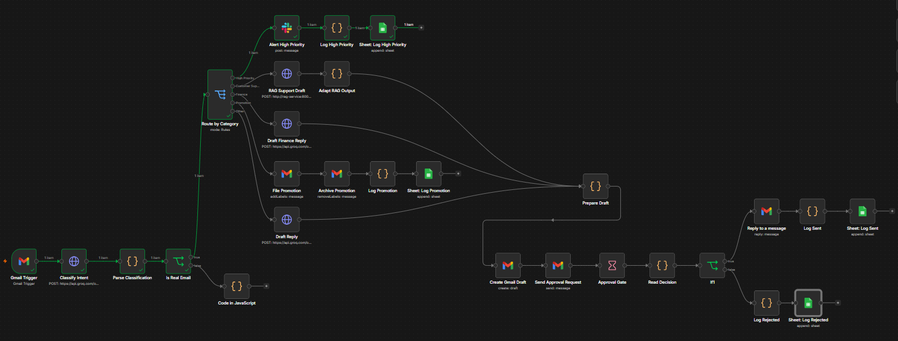
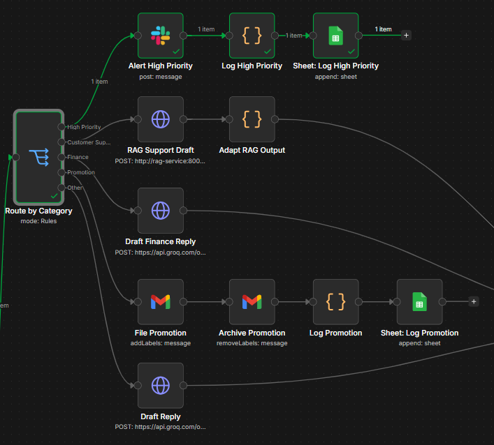
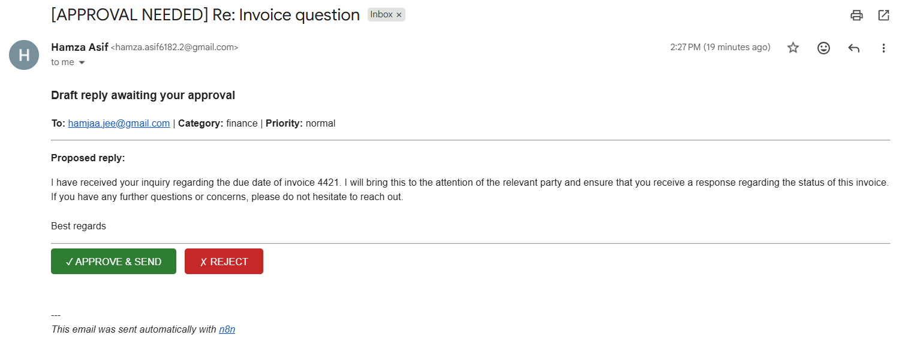
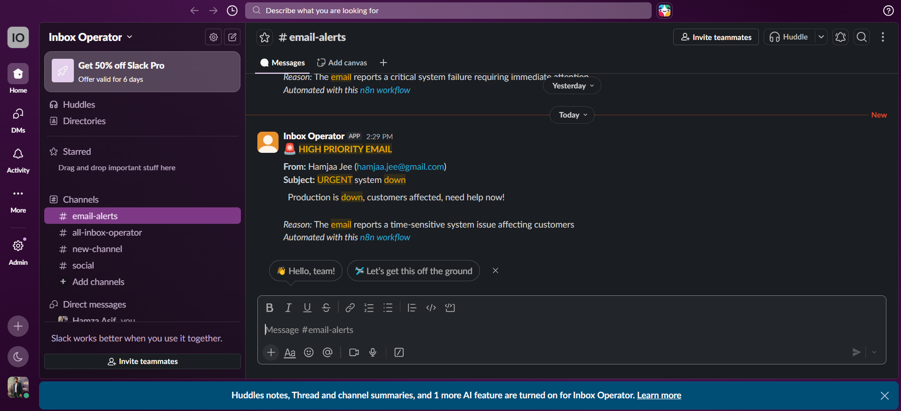
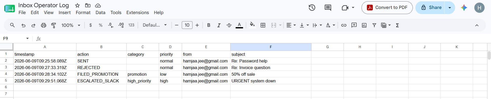

# Inbox Operator

**Category-aware AI email triage with specialized handlers and a human-in-the-loop guardrail.**

Inbox Operator watches an inbox, classifies each incoming email into a category, and routes it to a specialized handler. Urgent mail escalates to Slack; customer-support questions are answered by a retrieval-augmented (RAG) microservice grounded in a knowledge base; finance and general emails get AI-drafted replies; promotions are auto-filed. Every reply that goes out first passes through a human approval gate, and every action is logged to an audit trail.

The core principle, preserved from v1 and extended across all reply paths: **AI proposes → human approves → send → log.** Nothing is ever sent automatically.

## The Problem

Auto-replying to email with an LLM is fast but risky — a misclassification or hallucinated commitment goes out under your name unchecked. And treating every email identically is crude: an urgent outage, a billing question, and a marketing blast need different handling. Inbox Operator sorts email by intent, handles each category appropriately, grounds support answers in real knowledge to avoid hallucination, and keeps a human in control of every send.

## Architecture

Gmail Trigger

-> Classify & Route (LLM -> category + priority, strict JSON)
-> Is Real Email? (guard: drops bounces / no-reply / system mail)
-> Route by Category (Switch)
|- High Priority    -> Slack alert (escalate to human, no auto-draft) -> Log
|- Customer Support -> RAG microservice (grounded draft) -> Approval Gate -> Send -> Log
|- Finance          -> finance-tuned draft -> Approval Gate -> Send -> Log
|- Promotion        -> label + archive (no reply) -> Log
|- Other            -> general draft -> Approval Gate -> Send -> Log

All reply-producing branches converge on a single approval gate: the draft is created as a real unsent Gmail draft, an approval email with Approve/Reject links is sent to the operator, and the workflow pauses until a decision. Approved replies are sent in-thread; every outcome is logged.

## RAG Support Service

The customer-support branch calls a separate **FastAPI microservice** (in `rag-service/`) rather than relying on a generic LLM prompt. The service:

1. Embeds the incoming email with a local sentence-transformers model (`all-MiniLM-L6-v2`).
2. Retrieves the most relevant entries from a **Chroma** vector store built from a knowledge base.
3. Generates a grounded reply with Groq, instructed to use **only** retrieved context and to escalate rather than invent details when the answer is not in the knowledge base.

It exposes a single `POST /support-reply` endpoint and is containerized, running alongside n8n on the same Docker network. The knowledge base is **synthetic** (a fictional SaaS product, "Nimbus"), used purely for demonstration.

A question with no knowledge-base answer (e.g. specific API rate limits) is correctly escalated instead of answered with invented numbers — the anti-hallucination guardrail.

## Escalation & Audit

High-priority emails post to a Slack channel for immediate human attention instead of being auto-drafted:

Every handled email is appended to a Google Sheet — a persistent audit trail of category, action (sent / rejected / filed / escalated), timestamp, sender, and subject:

## Tech Stack

- **n8n** (self-hosted, Docker) — orchestration and routing
- **Gmail API** (OAuth2) — email source, draft creation, in-thread reply, labeling
- **Groq** (Llama 3.3 70B) — classification and drafting
- **FastAPI + Chroma + sentence-transformers** — the RAG support microservice
- **Slack API** — high-priority escalation
- **Google Sheets API** — audit logging
- **Docker / docker-compose** — n8n and the RAG service on a shared network

## Setup

1. Install Docker Desktop.
2. Clone this repo. Create a `.env` in the project root with `GROQ_API_KEY=...` (used by the RAG service via docker-compose).
3. Run `docker compose up -d --build` to start n8n and the RAG service. The RAG image builds its vector store at build time.
4. Open http://localhost:5678, create a local owner account, and configure credentials in n8n: Gmail OAuth2, Groq (Header Auth), Slack (bot token), and Google Sheets OAuth2.
5. Import `workflows/inbox-operator.json`.
6. Verify the RAG service: `curl http://localhost:8000/health` should report the document count.

## Technical Decisions

- **RAG as a separate microservice, not an in-n8n vector node** — keeps the AI engineering as an ownable, testable, containerized artifact and keeps n8n as the orchestrator.
- **Vector store + embedding model baked into the Docker image at build time** — the container starts self-contained and demo-ready, with no runtime setup.
- **All reply branches converge on one approval gate** — the human-in-the-loop guardrail is preserved across every category rather than duplicated per branch.
- **High priority escalates rather than auto-drafts** — urgent mail needs a human fast, not a slow AI reply.
- **Slack for escalation (chosen over Telegram)** — Telegram is regionally blocked; Slack is a realistic workplace channel with first-class n8n support.
- **In-thread reply via message ID** — robust to sender-header quirks; the reply routes back through the original thread.
- **Category-specific drafting prompts** — finance replies are explicitly forbidden from inventing amounts or commitments.

## What Didn'\''t Work / Lessons

- **A brand-new Gmail used only for API setup was auto-disabled** by Google'\''s abuse heuristics; a mature account avoided the false positive.
- **Mail between sibling Gmail accounts silently failed to deliver**; routing the operator/approval mail within a single account fixed it.
- **The Wait node'\''s resume URL already carried a `?signature=` param**, so appending `?decision=` produced a malformed double-query URL ("Invalid token"); using `&decision=` fixed it.
- **n8n fields are either Fixed or Expression** — a `=` typed into a Fixed field is sent literally (e.g. `=address@…`), causing bounces; JSON-body fields must be in Expression mode or the LLM receives an empty body.
- **A bounce notification was picked up as a new incoming email**, risking a reply loop — the reason for the system-email guard.
- **Outlook/Exchange masks the sender behind a privacy-relay alias**; the real address appears nowhere in the headers, so replies bounce at the recipient'\''s server. Diagnosed from bounce headers. Normal Gmail senders deliver correctly.
- **Telegram is blocked in the deployment region**, forcing a pivot to Slack for escalation.
- **n8n references Gmail labels by internal ID, not name** — deleting and recreating a label breaks the node reference until it is reselected.
- **PowerShell `Out-File -Encoding utf8` adds a BOM** that breaks JSON and `.env` parsing; reading with `utf-8-sig` or writing as `ascii` avoids it.

## Roadmap

- Interactive Approve/Reject buttons in Slack (requires a public callback URL/tunnel).
- Editable drafts in the approval step.
- Confidence-scored routing with tiered autonomy.

## Versions

- **v1.0** — single-lane triage with the human-in-the-loop approval gate.
- **v2.0** — category-aware routing, RAG support agent, Slack escalation, and audit logging.