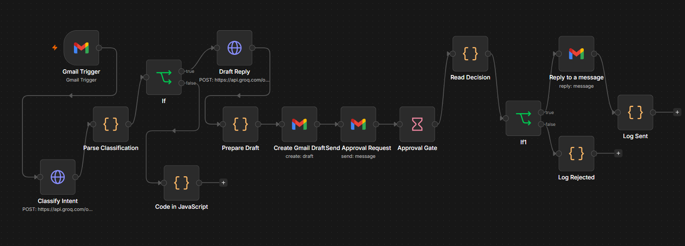
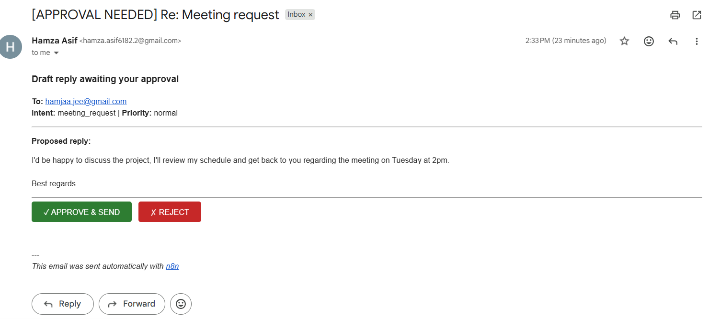
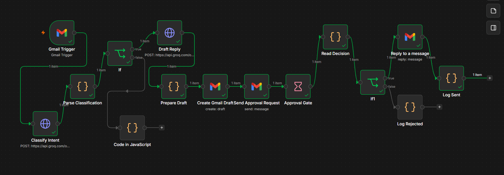
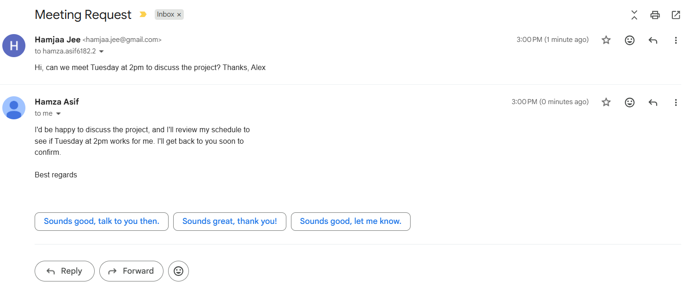

# Inbox Operator

**AI email triage & draft automation in n8n — AI proposes, a human approves, then it sends and logs.**

An n8n workflow that watches an inbox, uses an LLM to classify each incoming email's intent and draft a suitable reply, then routes that draft into a human-approval gate. Nothing is ever sent automatically: the operator reviews the proposed reply, clicks **Approve** or **Reject**, and only an approved reply is sent — in-thread — and every outcome is logged.

## The Problem

Auto-replying to email with an LLM is easy to demo and dangerous in practice: a wrong classification or a hallucinated commitment goes out under your name with no chance to intervene. Inbox Operator keeps the speed of AI drafting while putting a human in the loop on every send. The design principle is a guardrail pattern:

**AI proposes → human approves → send → log.**

## Architecture

Flow:

1. **Gmail Trigger** — fires on each new incoming email.
2. **Classify Intent** (Groq LLM) — returns strict JSON: intent, priority, reason, needs_reply.
3. **Parse Classification** — parses the LLM JSON and merges it with the original email fields.
4. **Is Real Email?** (guard) — drops mailer-daemon / no-reply / system mail before drafting, preventing reply loops.
5. **Draft Reply** (Groq LLM) — writes a concise reply; instructed not to invent facts or commitments.
6. **Prepare Draft** — assembles the draft plus thread/sender metadata.
7. **Create Gmail Draft** — saves a real, unsent draft in Gmail.
8. **Send Approval Request** — emails the operator the proposed reply with **Approve** / **Reject** buttons.
9. **Approval Gate** (Wait) — pauses the workflow until the operator clicks a link.
10. **Read Decision** — reads which button was clicked.
11. **Approved?** (IF) — true → **Send Reply** (replies in-thread) → **Log Sent**; false → **Log Rejected**.

## Tech Stack

- **n8n** (self-hosted via Docker) — workflow orchestration
- **Gmail API** (OAuth2) — email source, draft creation, and in-thread reply
- **Groq** (Llama 3.3 70B, OpenAI-compatible API) — classification + drafting
- **Docker / docker-compose**

## Setup

1. Install Docker Desktop.
2. Clone this repo and run `docker compose up -d`.
3. Open http://localhost:5678 and create a local owner account.
4. In n8n, configure credentials (see `.env.example`):
   - **Gmail OAuth2** — from a Google Cloud project with the Gmail API enabled and an OAuth client whose redirect URI is `http://localhost:5678/rest/oauth2-credential/callback`.
   - **Groq** — a Header Auth credential: `Authorization: Bearer <your-groq-key>`.
5. Import `workflows/inbox-operator.json`.
6. Send a test email to the connected inbox and run the workflow.

## Demo

*The operator receives the proposed reply with Approve / Reject buttons.*

*A full execution: classify → draft → approval gate → send.*

*On approval, the reply is delivered in-thread to the original sender.*

## Technical Decisions

- **Self-hosted n8n over n8n Cloud** — an owned, committable artifact (docker-compose + exported workflow), with no trial expiry.
- **Groq over OpenAI** — free tier, fast, OpenAI-compatible, so a generic HTTP Request node works.
- **HTTP Request node for the LLM, not a prebuilt node** — exposes the real request/response shape and keeps the model swappable.
- **Create a Gmail draft before sending** — the proposed reply exists as an inspectable, unsent artifact; the safest possible default if anything fails downstream.
- **Reply in-thread via message ID, not a parsed To address** — the reply routes back to the true sender through Gmail, which is more robust than trusting a parsed header.
- **Decision passed via two resume-URL links** — this n8n version's Wait node has no built-in approval buttons, so the human-in-the-loop logic is built explicitly and is visible in the workflow.
- **System-email guard before drafting** — saves LLM calls and prevents reply loops on bounces.

## What Didn'\''t Work / Lessons

- **A brand-new Gmail used only for API setup got auto-disabled** by Google'\''s abuse heuristics right after creating a Cloud project — using a mature account avoided the false positive.
- **Mail between two sibling Gmail accounts silently failed to deliver**, which first surfaced as a mysterious missing approval email. Routing the approval to the operator inbox itself fixed it.
- **The resume URL already carried a `?signature=` query param**, so appending `?decision=approve` produced a double-`?` and an "Invalid token" error. Using `&decision=` to extend the existing query string fixed it.
- **A `=` typed into a fixed Gmail field was sent literally** (`=address@…`), causing a "no such user" bounce. n8n fields are either Fixed (plain text, no `=`) or Expression (toggle on, `{{ }}` evaluates) — the `=` is never typed manually.
- **A bounce notification got picked up as a new incoming email**, nearly creating a reply loop — the reason the `Is Real Email?` guard exists.
- **Outlook/Exchange masks the sender behind a privacy-relay alias** (e.g. `outlook_XXXX@outlook.com`). The real address appears nowhere in the headers, so no send method can reach it; replies bounce at the recipient'\''s server. Diagnosed from the bounce headers. Normal Gmail senders expose their real address and deliver correctly.

## Notes & Limitations

- Built and tested locally; n8n runs on `localhost`, so the approval links work from the same machine. A production deployment would expose n8n behind a tunnel/domain and use a verified sending domain to avoid spam filtering.
- Tested with Gmail senders; provider-side privacy relays (Outlook) cannot receive replies by design.
